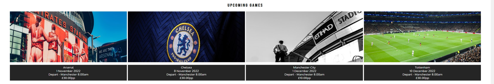
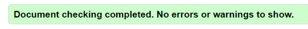
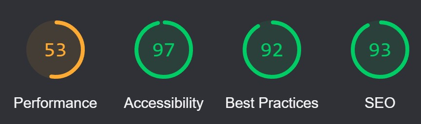

# Manchester United Supporters Away Travel Club

The Manchester United Supporters Away Travel Club website is for Manchester United supporters looking for travel to football matches to see Manchester United. The website allows supporters to discover what travel options are available for future football matches and sign up to the club. It allows supporters with match tickets from Manchester United football matches to have access to a travel club which provides first class travel to Manchester United football matches throughout England and Europe. 

Users of the website can find out about the luxury coach that will transport supporters to the games, what facilitles are on the coach, what games coming up that they can look to book the coach for and a sign up form. The site is targetting Manchester United football supporters who are wanting an exciting mode of transport to football matches throughout Europe. 

## Features

- Navigation Bar
    - Featured on all three pages at the top of each page. It includes links to the logo (which links back to the index page), Games and Sign Up. The navigation bar is the same on each page to allow easy navigation throughout the site.
    - It allows users to navigate to any page on the website without having to use any browser buttons such as 'back' or 'forward'.

    

- The landing page and hero image
    - The landing includes a hero image and cover text which allows the user to see what the website is about. The image includes an animation which should draw the user into the page, whilst the cover text details clearly what the website is about. 

    

- Upcoming Games section
    - The upcoming games secton allows the user to see what upcoming games the travel club will be attending in the future. It is limited to 4 upcoming games. 
    - This section allows the user to find what the upcoming games are quickly. It provides details of the game, the date of the game, the time the game kicks off, Departure time and the cost of the trip.  

    

- Why Travel with Manchester United Supporter Away Travel Club section
    - This sections allows the user to see the benefits of travelling with the travel club. It details the luxury coach travel, the facilities and the wide range of refreshments available on the coach. 
    - The user will see the value of travelling with the Travel club and understand it is more than just transport to the football game, but allows the user to travel in luxury and enjoy refreshments. 

    

- Google Maps
    - This section allows the user to see the location of where the travel coach departs from using Google Maps. It allows the user to find the location of departure without having to leave the website. 

    

- Footer
    - The footer includes links to all of the social media sites for the Manchester United Supporters Away Travel Club. 
    - The footer allows the user further access to the Manchester United Supporters Away Travel Club through their social media sites. 

    

- Games Page
    - The page allows the user to see a full list of all the upcoming games that the travel club will be providing transport for. It provides details of the game, the date of the game, the time the game kicks off, Departure time and the cost of the trip.  
    - The section is valuable to the user, as it allows them to see a full list of the games that the travek club will be travelling to, as more fixtures are announced, the list will be added to, which will provide the user with more options of games to pick from. 

    

- Sign Up Page
    - The page allows the users to sign up to the Manchester United Supporters Away Travel Club. The user is asked to submit their Name, Email, Address, what age bracket they are in, whether they are currently a season ticket holder. The user is able to select which games they would be interested in travelling to with the Travel Club, they can as many options as they wish. 

    

- Possible Future Features to Implement

    - A Gallery page where users can see other users who have been on trips with the travel club. This could also include a youtube videos of trips. 
    - A review section where users can see reviews from other users to gain an independent review of the travel club. 

## Testing

### HTML

- No errors were returned when passing through the official [W3C validator](https://validator.w3.org/)

- index.html 

- games.html

- signup.html 

### CSS

- No errors were returned when passing through the official [Jigsaw validator](https://jigsaw.w3.org/css-validator/)

- style.css

### Responsive

- Am I responsive: The site is responsive to different screen sizes. Tested through [Am I Responsive?](https://amiresponsive.co.uk/)

- Website tested using Chrome devtools on various screen sizes. 
- Media Queries were added to the CSS Stylesheet:
    - For larger to medium screens size from 1200px wide and down
    - Medium screen sizes from 950px wide and down

### Lighthouse

- Website tested on lighthouse
    - Perfomance 91
    - Accessibility 97
    - Best Practices 92
    - SEO 97

### Unfixed Bugs

- The flexbox css styling on the Games page does not line up all the images as neatly as I would like. This is something I would want to work on and improve in the future. 

- Images that are used on the site are rather large in size and they could be adjusted to allow for faster loading times on those with a slower internet connection

## Deployment

- The site was deployed to GitHub pages. The steps to deploy are as follows:
    - In GitHub repository, naviagte to the Settings tab
    - Click on Pages
    - Select main branch and GitHub builds site from main branch

The live link is here - https://richburman.github.io/Project-1/

## Credits

Contents

- Research using [w3schools](https://www.w3schools.com/css/css3_flexbox.asp) to learn about how to use flexbox
- The icons in the footer were taken from [Font Awesome](https://fontawesome.com/)
- The fonts were taken from [Google Fonts](https://fonts.google.com/)
- The football teams used in the website are members of the [Premier League](https://www.premierleague.com/)
    - [Manchester United](https://www.manutd.com/)
    - [Arsenal FC](https://www.arsenal.com/)
    - [Chelsea FC](https://www.chelseafc.com/en)
    - [Manchester City FC](https://www.mancity.com/)
    - [Tottenham Hotspur FC](https://www.tottenhamhotspur.com/)

Media

- All images were taken from [Unsplash](https://unsplash.com/)
